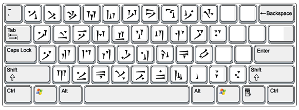

# fonts/dragon-alphabet 

From thuum.org: 

> The Dragon Alphabet font has all 34 runes mapped to both the upper and lower cases. Special characters are mapped on the numbers 0-9. This is the font that is used throughout the site. It also features punctation such as periods, commas, question marks, and exclamation points. 

Retrieved from https://web.archive.org/web/20240121002703/https://www.thuum.org/downloads.php#font